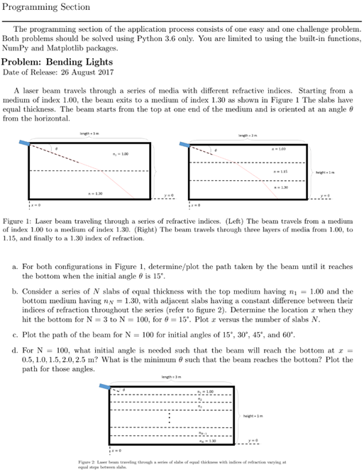

<h2>Description</h2>
This was another project I did in my undergraduate program. I was an applicant to one of the prominent research labs in Physics, and this was part of a series of their coding tests.<br/>
<kbd>

</kbd>
<br/>
<br/>
The problem was clear, and this exercise is always tackled in the foundational lessons of ray optics.

<h2>Programming Proper (WIP)</h2>
It is a straightforward application of Snell's Law:
$n_1 \sin \theta_1 = n2 \sin \theta_2$


In hindsight, this would have been much easier and efficient if we were taught algorithms for these problems, e.g. depth-first search, breadth-first search, A* search, etc. However, not knowing these things also served as a means for us to set down our own logic or approach, i.e. our own "algorithm".

Starting out with the packages to be used for the entire code:

```python
import numpy as np
import matplotlib.pyplot as plt
```

First is to write a code that uploads the image into the program and convert it into binary. Thankfully, the image was given in black and white so there was no need to recolor or preprocess.

```python
def load_maze(image_path):
    img = plt.imread(image_path)
    maze = (img == 0).astype(int)
    return maze
```

For each pixel, the code checks if the value is black or white. I then programmed it to follow the convention suggested in the problem where 1 will be the walls and 0 will be the path.

Calling out the maze function now, it looks like so (albeit truncated):


Next is the meat of the problem: solving for the maze. Two things come to mind: I need to write a code that will "walk" through the maze and, prior to that, check its neighboring cells if it's even a walkable path.

Since this is a 2D maze, checking for surrounding paths is also done in 2D (**x**'th row and **y**'th column). And knowing whether or not a path is walkable means acceding to these rules:

- path is not a wall
- path is within the bounds of the maze
- path has not been visited

Thus the code is written as follows:

```python
def walkability(maze, visited, x, y):
    if maze[x, y] == 1:             # this checks if move hits a wall
        return False
    if x < 0 or x >= maze.shape[0]: # this checks if move is within vertical bounds
        return False
    if y < 0 or y >= maze.shape[1]: # this checks if move is within vertical bounds
        return False
    if visited[x, y]:               # this checks if move has been done
        return False
    return True                     # if conditions are met then path is walkable
```

Next is the function that will generate our solutions. We expect an array output of these solutions, thus we need to intialize a list that will store the successful paths (the solutions themselves) and another list that will act as the stack for exploring paths (where newfound positions are pushed onto this stack).

```python
def maze_solution(maze, start, end):
    solutions = []
    stack = []
    stack.append((start, [start]))
```

The last part adds an item to the stack, where the tuple "(start, [start])" keeps track of both the current position and the path taken to reach it. As the algorithm continues, it will continue to add new positions and their corresponding paths to the stack as it explores the entire maze. Now it's time to write the part that explores the maze:

```python
    while len(stack) > 0:                                    # loop to continue exploring while there are still paths to explore
        current_pos, current_path = stack.pop()              # takes the last position and its path from the stack
        current_x, current_y = current_pos                   # extracts the current x and y coordinates

        for direction in [(0, 1), (1, 0), (0, -1), (-1, 0)]: # explores all possible directions from current position
            new_x = current_x + direction[0]
            new_y = current_y + direction[1]
            new_pos = (new_x, new_y)
            if walkability(maze, np.array(current_path), new_x, new_y):
                new_path = current_path + [new_pos]     # adds new position and its path to the stack
                stack.append((new_pos, new_path))

        if current_pos == end:                               # checks if end of the maze has been reached
            solutions.append(current_path)
            if len(solutions) >= 2:                          # stops code at 2 solutions as per the problem statement
                break

    return solutions
```
Finally, all that's left is outputting the solutions. Currently, it's in 0s and 1s. This is the code to visualize them:

```python
def plot_maze(maze, solutions):
    plt.imshow(maze)
    for solution in solutions:
        x_coords, y_coords = zip(*solution)
        plt.plot(y_coords, x_coords, marker='o')
    plt.show()
```

At last, the code is finished. The output, i.e. answer to the maze, looks like so:


This was perhaps the most difficult program I handled back in college and there is definitely room for optimization in the code given its verbose nature. Nonetheless, I call this a definitive moment because, plot twist, I actually deferred from the application process. I was given the opportunity to represent my university in a week-long sports competition (UAAP) in fencing and I prioritized it. Thus, this became a stark example/reminder of a "right place but a wrong time".
