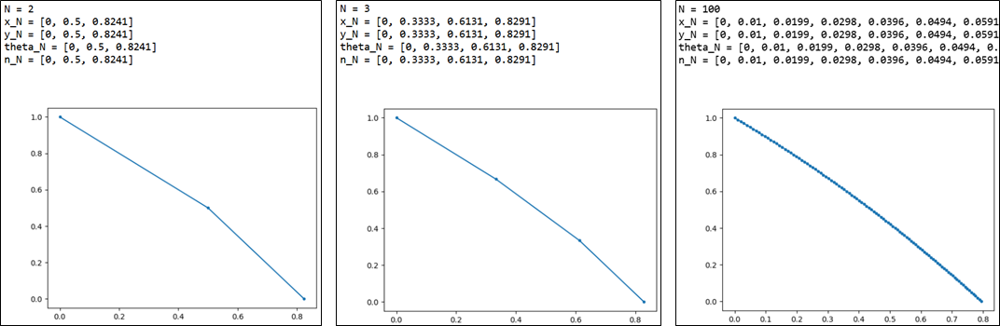

<h2>Description</h2>
This was another project I did during my undergraduate program. I was an applicant to one of the prominent research labs in Physics, and this was part of a series of their coding tests.<br/>
<kbd>

</kbd>
<br/>
<br/>
This exercise is always tackled in the foundational topics of ray optics.

<h2>Programming Proper</h2>
The program is a straightforward utilization of Snell's Law:

$n_1 \sin{\theta_1} = n_2 \sin{\theta_2}$ <br/> $n_N \sin{\theta_N} = n_{N+1} \sin{\theta_{N+1}}$  (a more useful form)

I approached this problem through the use of x-y coordinates. Meaning, the ray can be traced by mapping out all the points $(x_N,y_N)$, starting at $(0,1)$ and ending at the floor of the last stated medium.

Consider items (a) - (c). The program must be able to do the following:
- take in an initial angle $\theta_1$ and an N amount of refractive indices $n_N$
- utilize Snell's law to calculate all $(x_N,y_N)$
- output a plot connecting said coordinates

Beginning at the angle of refraction $\theta_N$, rearranging Snell's law we get

$\theta_2 = \sin^{-1}\left(\frac{n_1 \sin{\theta_1}}{n_2}\right)$ <br/> $\theta_{N+1} = \sin^{-1}\left(\frac{n_N \sin{\theta_N}}{n_{N+1}}\right)$  (a more useful form)

From the diagram, we know that $(x_1, y_1) = (0,1)$. Assuming $y$ is evenly distributed across varying refractive indices, then subsquent $y_N = y_{previous} - \frac{y_{max}}{N} = y_{previous} - \frac{1}{N}$ (negative sign is because we are moving downwards in our diagram), and the boundaries are at $y_{first} = 1$ and $y_{last} = 0$. Using item (a) for visualization, these are the variables that are needed to be able to trace the ray:

Proposed Schematic  |  Variables Required
:------------------:|:------------------:
  |  $(x_1, y_1) = (0, 1)$ <br/> $(x_2, y_2) = (\textcolor{red}{x_2, y_2})$ <br/> $(x_3, y_3) = (\textcolor{red}{x_3}, 0)$

Here, $x_N$ can be solved mathematically:

$\tan{\theta_1} = \frac{x_2}{y_1-y_2}$ <br/> $x_2 = (y_1-y_2) \cdot \tan{\theta_1}$ <br/> $x_{N+1} = (y_N-y_{N+1}) \cdot \tan{\theta_N}$  (a more useful form)

From above, $y_N$ and $\theta_N$ are required to solve for $x_N$.

Let's start with $y_N$. Again, since the y's are evenly distributed vertically, they are highly dependent on the number of refractive indices $n_N$:

```python
n_N = [1.00, 1.30]                          # given; must be in list-form and in the correct sequence
y_N = [0, 1]                                # y = 0, 1 for the extrema
N = len(n_N)

y_N = [0, 1]
while len(y_N) <= N:
    y_New = y_N[0] + 1/N
    y_N.insert(0, y_New)
y_N.sort(reverse = True)                    # since we start at y = 1 and end at y = 0
```
Output:
```python
print(y_N)
---
[1, 0.5, 0]
```

Next, we need values for $\theta_N$. Although the first value, $\theta_1$ can already be used to get $x_1$, it's wiser to write the code now for the succeeding values:

```python
import numpy as np

theta_init = 15                           # given, in degrees
theta_rad = [np.radians(theta_init)]
n_N = [1.0, 1.30]                         # given

for i in range(len(n_N)-1):
    theta_next = np.arcsin(n_N[i] * np.sin(theta_rad[i]) / n_N[i+1])
    theta_rad.append(theta_next)

theta_N = [round(np.degrees(j)) for j in theta_rad]
```
Output:
```python
print(theta_N)
---
[15, 11]
```

From above, the lists of $y_N$ and $\theta_N$ are now available, the program to obtain $x_N$ is as follows:
```python
theta_N = [0.2618, 0.1920]
y_N = [1, 0.5, 0]
x_N = [0]                           # initial value given

for k in range(len(theta_N)):
    x_next = x_N[k] + (y_N[k] - y_N[k+1]) * np.tan(theta_N[k])
    x_N.append(x_next)
```
Output:
```python
print(x_N)
x_N = [0, 0.13397492429306218, 0.23117223039420248]
```

Compiling the code (see working code in file) and using the library 'matplotlib' for visualization, we get the following:

<kbd>

</kbd>
