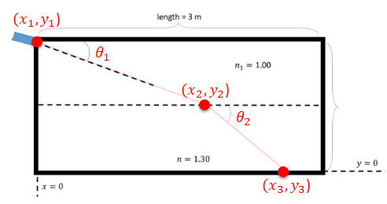

<h2>Description</h2>
This was another project I did during my undergraduate program. I was an applicant to one of the prominent research labs in Physics, and this was part of a series of their coding tests.<br/>
<kbd>

</kbd>
<br/>
<br/>
This topic is always tackled in the foundational lessons of ray optics.

<h2>Programming Proper (WIP)</h2>
The program is a straightforward utilization of Snell's Law:

$n_1 \sin{\theta_1} = n_2 \sin{\theta_2}$ <br/> $n_N \sin{\theta_N} = n_{N+1} \sin{\theta_{N+1}}$  (a more useful form)

We approach this problem through the use of x-y coordinates. Meaning, the ray can be traced by mapping out the points starting from its incident $(x_1,y_1) = (0,1)$ down to the next point where the refractive index changes, and so forth for multiple $n_N$.

To get a grasp, consider item (a). From Snell's law, we can compute the angle of refraction $\theta_2$ at $n_2$:

$\theta_2 = \sin^{-1}\left(\frac{n_1 \sin{\theta_1}}{n_2}\right)$ <br/> $\theta_{N+1} = \sin^{-1}\left(\frac{n_N \sin{\theta_N}}{n_{N+1}}\right)$  (a more useful form)

From the diagram, we know that $(x_1, y_1)$ is $(0,1)$. Assuming that y is evenly distributed across varying refractive indices, then $y_N = 1/N$ with $y_1 = 1$ and $y_{last} = 0$. In summary, these are the variables that we need to solve to be able to trace the ray:

Proposed Schematic  |  Variables Required
:------------------:|:------------------:
  |  $(x_1, y_1) = (0, 1)$ <br/> $(x_2, y_2) = (\textcolor{red}{x_2, y_2})$ <br/> $(x_3, y_3) = (\textcolor{red}{x_3}, 0)$

Here, $x_N$ can be solved mathematically:

$\tan{\theta_1} = \frac{x_2}{y_1-y_2}$ <br/> $x_2 = (y_1-y_2) \cdot \tan{\theta_1}$ <br/> $x_{N+1} = (y_N-y_{N+1}) \cdot \tan{\theta_N}$  (a more useful form)

From above, we must be able to provide all $y_N$ and $\theta_N$ to solve for $x_N$.

Let's start with $y_N$. Again, since the y's are evenly distributed vertically, they are highly dependent on the number of refractive indices $n_N$:

```python
n_N = [1.00, 1.30]                          # given; must be an array/list and in the correct sequence
y_N = [0, 1, 1/len(n_N)]                    # y = 0, 1 for our extrema
                                            # y = 1/len(n_N) for the y's in the middle

while len(y_N) <= len(n_N):
    y_N.append(y[-1] + 1/len(n_N))
y_N.sort(reverse = True)                    # since we start at y = 1 and end at y = 0
```
Output:
```python
print(y_N)
---
[1, 0.5, 0]
```

Next, we need values for $\theta_N$. Although the first value, $\theta_1$ can already be used to get $x_1$, it's wiser to write the code now for its succeeding values:

```python
import numpy as np

theta_N = [0.26]                            # given, convert to radians
n_N = [1.0, 1.30]

while len(theta_N) < len(n_N):
    for i in theta_N:
        if i <= -1 or i >= 1:               # limits of sine function 
            continue
    for j in range(len(n_N)-1):
        theta_next = np.arcsin(j * np.sin(i) / n_N[j+1])
        theta_N.append(theta_next)
```
[WIP TBD]
